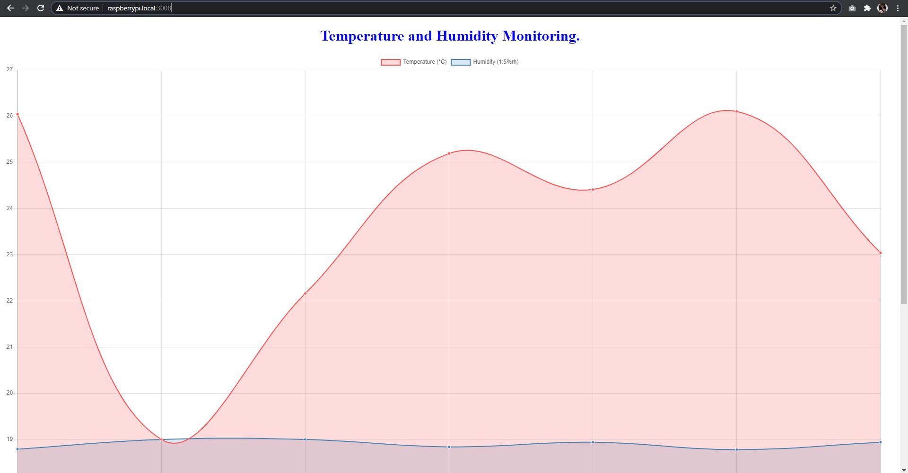
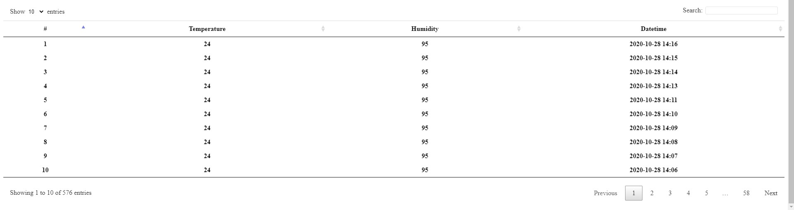

# Temperature and Humidity Sensor x Real Time Clock
## Features
- สามารถอ่านข้อมูลอุณหภูมิ ความชื้น เวลาจาก DHT11 Sensor และ Module RTC แล้วทำการจัดเก็บลงฐานข้อมูลได้
- สามารถอ่านข้อมูลอุณหภูมิ ความชื้น เวลา ที่ถูกเก็บบนฐานข้อมูลมาแสดงผลเป็นกราฟ และตารางข้อมูลย้อนหลังได้




## Read and Store Data
### การอ่านข้อมูลอุณหภูมิ ความชื้น และเวลา จาก DHT11 Sensor และ RTC Module
ในการทดลองนี้ผู้ทดลองได้เลือกใช้ Python ประกอบกับ Python Library ในการอ่านข้อมูลอุณหภูมิ ความชื้น จาก DHT11 Sensor และอ่านข้อมูลวันเวลาปัจจุบันจาก RTC Module โดยมีรายละเอียดดังนี้
- การอ่านข้อมูลอุณหภูมิและความชื้นจาก DHT11 Sensor

ใช้ library Adafruit_DHT ในการอ่านข้อมูลโดยสามารถทำการติดตั้งได้ด้วยคำสั่ง
```
    sudo pip3 install Adafruit_DHT
```
**หมายเหตุ** หากไม่สามารถดำเนินการได้ให้ทำการติดตั้ง pip3 และ setuptools โดยใช้คำสั่ง
```
    sudo apt-get update
    sudo apt-get install python3-pip
    sudo python3 -m pip install --upgrade pip setuptools wheel
```

สามารถทำการทดลองอ่านค่าได้ดังต่อไปนี้
```py
    import Adafruit_DHT
    humidity, temperature=Adafruit_DHT.read_retry(sensorType,pin)
    if humidity is not None and temperature is not None:
        print('Temp={0:0.1f}* Humidity={1:0.1f}%'.format(temperature, humidity))
    else:
        print('Failed to get reading. Try again!')
```

- การอ่านข้อมูลวันเวลาปัจจุบันจาก RTC Module

ในที่นี้ใช้ RTC Module ds3231 จึงเลือกใช้ library adfruit_ds3231 ในการอ่านข้อมูลโดยสามารถทำการติดตั้งได้ด้วยคำสั่ง
```
    sudo pip3 install adafruit-circuitpython-ds3231
```

ในการประกาศเพื่อใช้งาน RTC DS3231 สามารถกระทำได้ดังนี้
```py
    import busio
    import adafruit_ds3231
    import time
    from board import *

    myI2C = busio.I2C(SCL, SDA)
    rtc = adafruit_ds3231.DS3231(myI2C) 
```
และสามารถทำการตั้งเวลาให้แก่ rtc ได้โดย
```
    rtc.datetime = time.struct_time((2020,11,24,15,6,0,0,9,-1))
```
แล้วจึงสามารถทำการอ่านค่าวันเวลาได้จากคำสั่ง
```
    t=rtc.datetime
    print(t)
    print(t.tm_hour,t.tm_min) #ในการอ่านค่าเวลาในหน่วยชั่วโมงและนาที
```

### จัดเก็บข้อมูลลงฐานข้อมูล

ในการจัดเก็บข้อมูลสำหรับการทดลองนี้นั้นจะใช้ MongoDB โดยอาศัย Mongoose ในการช่วยจัดการข้อมูล ซึ่ง Mongoose นี้จะมีการกำหนด Schema ภายในฐานข้อมูล แล้วจึงทำการสร้าง Model ขึ้นจาก Schema ดังกล่าว โดยที่ Model นี้จะมี Method ในการจัดเก็บข้อมูลอันได้แก่ .insertMany(); เป็นต้น
- ในขั้นตอนแรกนั้นผู้ทดลองได้กำหนด Schema ข้อมูลขึ้นมา แล้วสร้างเป็น Model ดังนี้
```js
var mongoose=require('mongoose');
var Schema=mongoose.Schema;

var tempSensorRTCSchema=new Schema({
    temperature: Number,
    humidity: Number,
    year: Number,
    month: Number,
    day: Number,
    hour: Number,
    minute: Number
});

const temp_rtc=mongoose.model('temp_rtc',tempSensorRTCSchema);
```
- ทดลองจัดเก็บข้อมูลลงฐานข้อมูลโดยใช้คำสั่งดังต่อไปนี้
```js
    temp_rtc.insertMany({
        temperature: 24,
        humidity: 80,
        year: 2020,
        month: 11,
        day: 23,
        hour: 3,
        minute: 30
    });
```

ซึ่งหลังจากที่สามารถจัดเก็บข้อมูลลงฐานข้อมูลได้แล้วนั้น ผู้ทดลองได้สั่งให้ python ส่ง POST Request มายัง URL ที่กำหนดเพื่อทำการจัดเก็บข้อมูลที่ถูกส่งมาลงฐานข้อมูลต่อไป

- การอ่านข้อมูลจาก Sensor แล้วทำการส่ง POST Request ขึ้น Server
```py
    import sys
    import Adafruit_DHT
    import busio
    import adafruit_ds3231
    import requests
    from board import *

    rtcI2C=busio.I2C(SCL,SDA)
    rtc=adafruit_ds3231.DS3231(rtcI2C)

    t=rtc.datetime

    while True:
        humidity,temperature=Adafruit_DHT.read_retry(11,24)
        if humidity is not None and temperature is not None:
            tempSensorRTC={
                "temperature": temperature,
                "humidity": humidity,
                "year": t.tm_year,
                "month": t.tm_mon,
                "day": t.tm_mday,
                "hour": t.tm_hour,
                "minute": t.tm_min
            }
            res=requests.post('http://localhost:3000/addData',tempSensorRTC)
            print(res)
            break
```
จากโค้ดข้างต้น เมื่อสามารถอ่านค่า humidity และ temperature ได้แล้ว โปรแกรมจะทำการส่ง POST Request ไปยัง localhost:3009/addData ด้วยข้อมูลที่ได้ จำนวนหนึ่งรอบเท่านั้น ซึ่งในที่นี้ผู้ทดลองได้ใช้ **crontab** ในการสั่งให้เรียกใช้งาน script python นี้ในทุก ๆ ช่วงเวลาที่กำหนด

- การจัดการ request เพื่อทำการเพิ่มข้อมูลลงฐานข้อมูลในฝั่ง server มีการดำเนินการในลักษณะดังต่อไปนี้
```js
    var express=require('express');
    var app=express();
    var mongoose=require('mongoose');
    var dbModel=mongoose().model('temp_rtc');

    app.get('/addData',(req,res)=>{
        var result=dbModel.insertMany(req.body);
        res.json(result);
    })

    app.listen(3000);
```

## Read and Display Data
### การอ่านข้อมูลอุณหภูมิ ความชื้นและเวลา
ผู้ทดลองได้ทำการสร้าง request handle method ขึ้นมาเพื่อทำการส่งข้อมูลที่ถูกจัดเก็บอยู่บนฐานข้อมูลกลับไป โดยส่งกลับไปเป็นทั้งข้อมูลทั้งหมด และข้อมูลเฉลี่ยย้อนหลังเจ็ดวัน โดยมีลักษณะดังต่อไปนี้
```js
    var express=require('express');
    var app=express();
    var mongoose=require('mongoose');
    var dbModel=mongoose().model('temp_rtc');

    app.get('/data',(req,res)=>{
        dbModel.find({},(err,data)=>{
            if(!err){
                let detail=new Array();
                let tmp={};
                data.forEach((item,index)=>{
                    if(!item.temperature||!item.humidity||item.humidity>100)return;
                    let dt=new Date(Date.UTC(item.year, (item.month-1), item.day, item.hour, item.minute));
                    detail.push({'dateTime':dt, 'temperature':item.temperature, 'humidity':item.humidity});
                });
                detail.sort((a,b)=>{
                    return b.dateTime-a.dateTime;
                });
                detail.forEach((item,index)=>{
                    if(isNaN(item.dateTime.getUTCDate())||isNaN(item.dateTime.getUTCMonth())||isNaN(item.dateTime.getUTCFullYear())||!item.temperature||!item.humidity||item.humidity>100)return;
                    let obj=tmp[item.dateTime.getUTCDate()+'/'+(item.dateTime.getUTCMonth()+1)+'/'+item.dateTime.getUTCFullYear()]=tmp[item.dateTime.getUTCDate()+'/'+(item.dateTime.getUTCMonth()+1)+'/'+item.dateTime.getUTCFullYear()]||{count:0, totalTemperature:0, totalHumidity:0};
                    obj.count++;
                    obj.totalTemperature+=item.temperature;
                    obj.totalHumidity+=(item.humidity/5);
                });
                let result=Object.entries(tmp).map(function(entry){
                    return {date: entry[0], temperature: entry[1].totalTemperature/entry[1].count, humidity: entry[1].totalHumidity/entry[1].count};
                });
                res.json({detail:detail, average: result.slice(0,7)});
            }
        }
    });
});
```

### การแสดงผลข้อมูลเป็นกราฟและตารางข้อมูล
ผู้ทดลองได้ใช้ bower เป็นตัวจัดการ frontend package ที่ใช้ในการแสดงผลตลอดจนการอัพเดตข้อมูลในทุก ๆ ช่วงเวลาที่กำหนด โดยจะทำการเพิ่มไฟล์ `.bowerrc` ใช้ในการกำหนด path ที่ต้องการข้อมูล package ซึ่งในที่นี้จะชี้ไปยัง public/lib โดยใช้คำสั่ง
```
{
    "directory": "public/lib"
}
```
**หมายเหตุ** public path ได้ถูกกำหนดเป็น static โดย express เรียบร้อยแล้วด้วยคำสั่ง
```js
    var express=require('express');
    var app=express();
    app.use(express.static('./public'));
```
- แสดงผลเป็นกราฟโดยใช้ chart.js

ทำการติดตั้งด้วยคำสั่ง
```
    bower install chart.js --save
    bower install angular-chart.js --save
```

- แสดงผลเป็นตารางข้อมูลโดยใช้ datatables

ทำการติดตั้งด้วยคำสั่ง
```
    bower install angular-datatables@0.6.2 --save
    bower install datatables.net --save
    bower install datatables.net-dt --save
```

- อัพเดตข้อมูลตลอดจนจัดการข้อมูลที่แสดงผลด้วย angular.js และ moment

ทำการติดตั้งด้วยคำสั่ง
```
    bower install angular --save
    bower install moment --save
```

#### การแสดงผลทั้งหมด
- ใช้ jade เป็น template โดยทำการ render ข้อมูลดังนี้
```jade
doctype html
html(lang="en")
    head
        meta(charset='utf-8')
        meta(name='viewport', content='width=device-width, initial-scale=1.0')
        link(rel="stylesheet", href="/lib/angular-datatables/dist/css/angular-datatables.min.css")
        link(rel="stylesheet", href="/lib/datatables.net-dt/css/jquery.dataTables.min.css")
    body(ng-app='app')
        h1(style='text-align: center; color: blue;') Temperature and Humidity Monitoring.
        div(ng-controller='LineCtrl')
            canvas(class="chart chart-line" chart-data="data" chart-labels="labels" chart-series="series" chart-options="options" chart-click="onClick")
        div(ng-controller='DatatablesCtrl')
            //- p {{ details }}
            table(datatable="ng" dt-options="dtOptions" dt-column-defs="dtColumnDefs" dt-instance="dtInstance" class="table table-striped table-bordered")
                thead
                    tr
                        th #
                        th Temperature
                        th Humidity
                        th Datetime
                tbody
                    tr(ng-repeat="detail in details")
                        th {{ $index+1 }}
                        th {{ detail.temperature }}
                        th {{ detail.humidity }}
                        th {{ detail.dateTime | formatAsDate }}
    script(src="/lib/jquery/dist/jquery.min.js")
    script(src="/lib/datatables.net/js/jquery.dataTables.min.js")
    script(src="/lib/chart.js/dist/Chart.min.js")
    script(type='text/javascript', src='/lib/angular/angular.min.js')
    script(src="/lib/angular-datatables/dist/angular-datatables.min.js")
    script(src="/lib/angular-chart.js/angular-chart.js")
    script(src="/lib/moment/min/moment.min.js")
    script(type='text/javascript', src='/tempChart.js')
```

จาก template ข้างต้นจะใช้ tempChart.js เป็นตัวควบคุมการแสดงผลข้อมูลทั้งหมด ซึ่ง tempChart.js มีข้อมูลดังนี้
```js
angular.module("app", ["chart.js","datatables"])
// Optional configuration
.config(['ChartJsProvider', function (ChartJsProvider) {
    // Configure all charts
    ChartJsProvider.setOptions({
        chartColors: ['#FF5252', '#4682B4'],
        responsive: true
    });
    // Configure all line charts
    ChartJsProvider.setOptions('line', {
        showLines: true,
        fill: false
    });
}])
.controller("LineCtrl", ['$scope', '$interval', '$http', function ($scope, $interval, $http) {
    $scope.onClick = function (points, evt) {
        console.log(points, evt);
    };
    $scope.options={
        legend:{
            display: true
        },
        line:{
            borderColor:['#FF5252', '#4682B4'],
        }
    }

    var refresh=()=>{
        $http.get('http://raspberrypi.local:3000/data').then((response)=>{
            let labels=new Array();
            let temperature=new Array();
            let humidity=new Array();
            angular.forEach(response.data.average,function(value, key){
                labels.push(value.date);
                temperature.push(value.temperature.toFixed(2));
                humidity.push(value.humidity.toFixed(2));
            });
            labels.reverse();
            temperature.reverse();
            humidity.reverse();
            $scope.labels=labels;
            $scope.series=['Temperature (*C)','Humidity (1:5%rh)'];
            $scope.data=[temperature,humidity];
        });
    };
    refresh();
    $interval(refresh,60000)
}])
.controller('DatatablesCtrl', ['$scope','$interval','$http', function ($scope, $interval, $http) {
    var refresh=()=>{
        $http.get('http://raspberrypi.local:3000/data').then((response)=>{
            $scope.details=response.data.detail;
        });
    };
    refresh();
    $interval(refresh,60000);
}])
.filter('formatAsDate',function(){
    return function(dateTime){
        return moment(dateTime).utc().format('YYYY-MM-DD HH:mm');
    }
});

```


